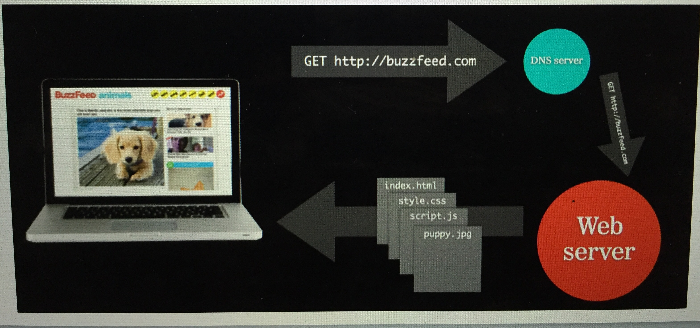

#  Coding 101 : HTML + CSS


### LEARNING OBJECTIVES
*After this lesson, you will be able to:*

- Gain an overview of the web development landscape and where HTML/CSS fits in the web ecosystem.
- Describe the difference between front-end and back-end code and the basic components of HTML, CSS, and Javascript.
- Use HTML and CSS to mark up a basic webpage.
- Describe the different jobs that use coding or benefit from an understanding of HTML/CSS.
- Describe the various opportunities to continue learning web-development.  

### STUDENT PRE-WORK
*Before this lesson, you should:*

- Install Sublime Text 3 on your computer.
- Have Google Chrome on your computer.

### INSTRUCTOR PREP
*Before this lesson, instructors will need to:*

- Have students install Sublime Text 3 or Atom on to computer.
- Write learning objectives on board.
- Make sure wifi network and password  (GA Guest, yellowpencil)  is written on board, since students will need to be online to use codepen.io.

---
<a name="opening"></a>
## Opening (5 mins)

- Review current lesson objectives.

> You can then include a hook / real-world relevance, here is a suggestion:
	 "Did you know that there are over one billion websites that are live today? You can reach so many people by creating a website that distributes your ideas in a unique way. Tonight we will be learning the building blocks that will allow you to get creative and bring your ideas to life."
	
- Each student will share first name and answer the following question: "What brought you here tonight?."

***

<a name="introduction"></a>
## Introduction: (15 mins)

> Instructor Note: Discuss topic and explain by dividing parts into sections. Ask students to define, explain, or recall any **specific** elements relating to the current topic, when applicable.

#### How the World Wide Web Works:

> In this section you will be discussing how the world wide web works. It is important here to include the following:

- Web communication comes down to requests and responses. 
- What is a host?

> Host: A server that stores the files that make up a website.  

- What is a client? 

> Client: user, the computer requesting to view the website. 

- What makes up a request? 

> Request: Starts off with the client typing the web address in to the browser address bar. Web browsers actually don’t use URLs to request web sites from servers, instead they use IP(internet protocol) addresses, which is just a series of numbers that is unique to a web address. Something called the DNS(Domain Name System) server is responsible for finding the IP address that matches the web address that was typed in. The corresponding IP address is sent back to your web browser. Your machine(client) then sends a request to the machine at the IP address specified. 

- What makes up a response?

> Response: The machine at the IP address specified holds the files that make up the front end of the website (the front end of the website is everything you can see and interact with). These files are sent to the client in the form of small data packets. 
> 
> When explaining the graphic below you can use the following to guide you:



- When you type in google.com in to the browser, you are sending what is called a *get request*.
- The request is first received by the DNS (Domain Name System) server, which serves like the "yellow pages" - it finds which IP (Internet Protocol) address matches the domain name the user typed in.
- Once the corresponding IP address is found, the request continues to the web server, which hosts the files that make up the front end of a site.

>
- Tie this in to why we as front end developers are a vital part of this cycle.
- Have students turn to person next to them and explain this cycle in their own words as if they were explaining it to someone who is 12 years of age.

> **Check:** Describe how requests differ from responses.

#### What is Web Development?:

> In this section you will be discussing what web development is on a high level. 

- The creation and management of both websites and web-based applications.
- Most Developers will try to convince you that it is magic, but it is mainly editing text files (coding / programming), and solving problems. 

#### Web Production Workflow:


> In this section you will be discussing the process of going from an idea to a fully developed and launched site. It is important here to include the following:

- UX: user experience, UX designers try to make it as easy as possible for people to use a webpage while achieving the purpose of the webpage.
- Design: designers take the wireframes created by the UX team and make them pretty (think about color palettes, font families...).
- Front End: front end developers bring the designs to life with HTML, CSS, and JS.
- Back End: back end developers give the website a "memory," you can briefly touch on databases, authenticating users etc.

#### Front End vs Back End in More Detail:

>
- Describe in more detail how the front end differentiates from the back end.
- Use the diagrams on slides 23-29 to help aid you with this description.
- If time permits you can visit expedia.com and describe to students which part of the site is front end and which is back end.

> **Check:** In summary, and in your own words, how would you describe how the front end is different from the back end of a website?

## Front End Languages: (10 mins)

> In this section you will break down for students that the THREE front end languages are HTML, CSS, and JavaScript.

- On the front end, the:
	- HTML = bones
	- CSS = skin
	- JavaScript = brain
- Another way to put it:
	- HTML = noun (responsible for the 'things' on the page, e.g image vs paragraph)
	- CSS = adjective (responsible for styles like color or font family)
	- JavaScript = verb (responsible for behaviors, like drop-down menus)
	
> End this section with the ACTIVITY: DISTINGUISH BETWEEN HTML, CSS, AND JS. The directions of this activity state:
> 
> 1. Let’s visit lyft.com together
2. The words “Rides in Minutes” appears due to ______?
3. The reason for which “Rides in Minutes”  is centered and white is due to _______?
4. Hover over the word “Explore” in the navigation menu. That animation is most likely due to _______?

## HTML Syntax (5 mins)

> In this section you will explain the HTML syntax. Start by explaining content tags, how they work, and what they are on a high level. You will then transition in to the demo.  

## Demo: HTML (20 mins)

- You will be learning how to write the following tags in Code Pen:

	| Tag Name:  |  Written As: | 
	|---|---|
	| Headings | h1 -> h6 
	|Paragraph | p 
	|Line break | br
	|Unordered list/list item | ul/li 
	|Ordered list/list item | ol/li
	|Image |img 
	|Anchor | a 

- A great resource is MDN (Mozilla Developer Network). MDN can be found at this [link](https://developer.mozilla.org/en-US/).

> During this demo you will be walking students through step by step instructions on how to write the tags above. You will type out each of these tags during this demonstration. 

> If you would like you can have students practice searching img and a tags on their own and implement them in Code Pen. A recommended search I like to tell student's about is "img tag mdn." 

## HTML Scaffold (15 mins)

> In this section you will be explaining the HTML scaffold below to students. You will explain in detail what each line of code is responsible for. Some important things to mention:

- <!DOCTYPE html> tells the browser that you are using HTML5.
- The html tag opens the HTML document, and the closing tag ends the HTML document.
- Nested within the html tags are two sections, the head and the body. Just like with the human anatomy, the head is above the body.
- The head contains information that you don't want the user to see within the browser window.
- The title tags declares what will be shown in the tab.
- The meta charset tag is responsible for character encoding.
- The body contains everything you do want the user to see within the browser window.

***

```html
<!DOCTYPE html>
<html>
  <head>
    <title>Example</title>
    <meta charset="UTF-8">
  </head>
  <body>
    <h1>Example Page</h1>
    <p>This is an example page.</p>
  </body>
</html>
```

***

> Ask students to watch you as you create an HTML document. Take them through the workflow:
>
	- Create a folder
	- Open the entire folder in editor
	- Save a file in the editor as index.html in the folder created
	- Type out the HTML scaffold
	- Show students how to open the HTML file in the browser

<a name="ind-practice"></a>
## Independent Practice: Creating your first HTML file (15 mins)


> Instructor Note: This can be a pair programming activity or done independently.

Here is the prompt for the deliverable:

1. Create a folder on your desktop and title it “Coding 101”
2. Open up the folder you just made in your text editor
3. Save your file as “index.html”
4. Type out the HTML basic layout  
5. Open up the HTML file in Google Chrome
6. Add more content tags: h1-h6, p, ul/li, button, a, img to create an “About Me” webpage
7. Keep your editor open


	| Tag Name:  |  Written As: | What will your content be: |
	| --- | --- | --- |
	| Headings | h1 -> h6 | Your Name
	|Paragraph | p | What you're passionate about
	|Line break | br
	|Unordered list/list item | ul/li | A list of your last three work positions
	|Ordered list/list item | ol/li
	|Image |img | Your LinkedIn photo
	|Anchor | a | A link to your LinkedIn profile

**Check:** Were students able to create the desired deliverable(s)? Did it meet all necessary requirements / constraints?

***

## CSS Syntax (10 mins)

> In this section you will be going over the CSS syntax. Important concepts to include are:

- CSS syntax differs from HTML.
- There are three types of CSS: inline (CSS is in the same line at the HTML, internal (CSS is in the same file as the HTML), and external (CSS is in a separate file, but in the same folder as the HTML). Industry standard is to create an external CSS file. 

> You can display this [website](http://www.w3schools.com/css/css_howto.asp) while you are explaining this concept.
> 
You will then transition in to the demo which will include showing students how to connect the HTML file to the external CSS file.


<a name="demo"></a>
## Demo: CSS (5 mins)

> Add styling to the basic HTML page you created in your last demo. Remember to connect your two files during your demo. Take them through the workflow:
>
- If closed, open up your folder than contains your HTML file in the editor
- Save a new file in the editor as style.css (make sure it is saved in the same folder as the HTML file)
- Style at least one element
- Save your file and open up project in the browser
- Ask students why nothing happened
- Students should respond that you need to connect the two files, once they do add a link tag to the head of your HTML file
- Refresh the page


```css
h1 {
  color: #85c9a9;
}
```

> **Check:** By this point, students should be able to write out an HTML file from scratch so that they can now add CSS to their pages.


<a name="ind-practice"></a>
## Independent Practice: Creating your first CSS file (10 mins)


> Instructor Note: This can be a pair programming activity or done independently.

Here is a prompt for the deliverable:

1. You should still have the “Coding 101” folder open in your editor
2. Create a new file from the editor, save the file as “style.css”
3. Add a few CSS properties(color, background-color, font-family, text-align) to the content created in the last activity. Ideas on what to do here: 
	- Make the picture rounded
	- Make the font of the paragraphs 30px font
	- Bonus: add a border to the top and bottom of the page 
4. Connect your external CSS file to your HTML file
5. Open up the HTML file in Google Chrome

> **Check:** Were students able to create the desired deliverable(s)? Did it meet all necessary requirements / constraints?

***

<a name="conclusion"></a>

## Conclusion (10 mins)
>
- Review independent practice deliverable(s). 
- Go over the last slides which have to do with how to edit an existing webpage, and a discussion on who needs to know the content covered in this class. If time permits you can cover what students can do after class or you can just let them know that they can reference the last couple of slides to find out.
- Recap topic(s) covered in today's lesson.

***

### BEFORE NEXT CLASS
|   |   |
|---|---|
| **HOMEWORK** | Dash Project 1  |


### ADDITIONAL RESOURCES
>
>- Add your own resources.
- There are a few listed in the slides, but feel free to remove these slides, change them, or just tell students that they are there for their reference.
